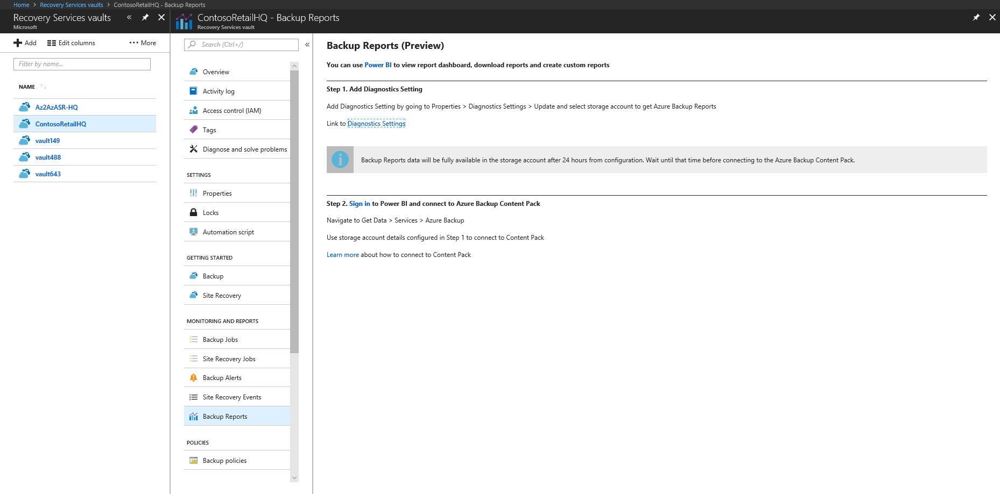
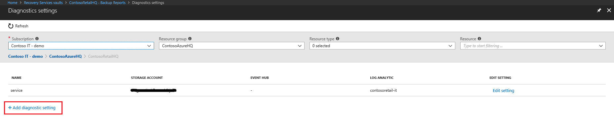
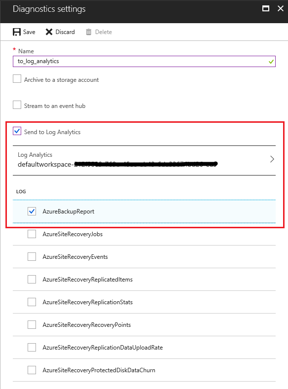

# Create a PowerBI dashboard for Service Providers

This tutorial explains how to build a Power BI dashboard that pulls information from several different Log Analytics workspaces belonging to different Azure Active Directory tenants. 

Log Analytics queries can be ran across workspaces under the same tenant (see [here] (https://docs.microsoft.com/en-us/azure/log-analytics/log-analytics-cross-workspace-search)), but this method doesn't work if the workspaces are located in different tenants. To do this, you can aggregate data in these workspaces through PowerBI. This article provides a step-by-step guide on how to build such a dashboard. 

Such a dashboard can provide a global view of all the customers/tenants being managed by a Service Provider, and therefore, simplify operations such as monitoring, backup or alerting.

In this tutorial you will learn:

> [!div class="checklist"]
> * Enable diagnostics for Recovery Services Vault
> * Export your Log Analytics queries to PowerBI
> * Build a PowerBI report that aggregates data from different workspaces/tenants 
> * Customize a tile in a shared dashboard
> * Understand key metrics for a Service Provider

To complete this tutorial you must have two or more Log Analytics workspaces located in two or more Azure AD tenants. These workspaces should have some logging information to build the first report. For this example, we have used Azure Backup diagnostic logs, but other logs can also be used.

> [!NOTE]
> Please review this article before you continue reading [Log Analytics features for Service Providers] (https://docs.microsoft.com/en-us/azure/log-analytics/log-analytics-service-providers#managing-multiple-customers-using-log-analytics).
>
>

## Log in to Azure Portal 

Login in to the Azure Portal at https://portal.azure.com.

## Enable diagnostics for Recovery Services Vault

Before starting, make sure that you have some activity in this Recovery Services Vault, for example some Virtual Machines being backed up against this vault.

Start by opeining your Recovery Services Vault:

1. In the Azure portal, click **All services**. In the list of resources, type **Recovery Services Vault**. As you begin typing, the list filters based on your input. Select **Recovery Services Vault**.
2. In the Recovery Services Vault subscriptions page, select the vault that you will work with
3. Select **Backup Reports** as shown in the picture. <br><br> 
4. Click on **Diagnostics Settings** in the right pane. You will see a lits of diagnostics settings already applied to this vault. This list might be empty.
5. Click on **Add diagnostic setting**. 
6. Enter a **Name** for this setting, select **Send to Log Analytics** checkbox, choose a **Log Analytics** workspace (or create a new one) and check **AzureBackupReport** checkbox. Click **Save**. 

After enabling diagnostics for your recovery service vault, logging data will start flowing into your Log Analytics workspace. These logs will be then available to be queried by the Log Analytics engine.

## Export your Log Analytics query to PowerBI

Now that we have some diagnostic data flowing into our Log Analytics workspace, we can perform queries against this data.

Go to your Log Analytics workspace:

1. In the Azure portal, click **All services** and select **Log Analytics**.
2. Select the **Log Search** tile.
3. Enter a query to see the status of Azure backup jobs.

```
let Events = (union workspace("contosoretail-it").AzureDiagnostics, workspace("soriomspowerbidemo").AzureDiagnostics)
| where Category == "AzureBackupReport" ;
Events
| where OperationName == "Job" and JobOperation_s == "Backup" 
| project ProtectedServerUniqueId_s, JobStatus_s, Resource, TenantId
| join kind=inner
(
    Events
    | where OperationName == "ProtectedServer"
    | where ProtectedServerFriendlyName_s != ""
    | distinct ProtectedServerUniqueId_s, ProtectedServerFriendlyName_s
    | project ProtectedServerUniqueId_s, ProtectedServerFriendlyName_s
)
on ProtectedServerUniqueId_s
| project ProtectedServerFriendlyName_s, JobStatus_s, Resource, TenantId
| extend Vault= Resource
| summarize count() by ProtectedServerFriendlyName_s, JobStatus_s, Vault, TenantId
```


