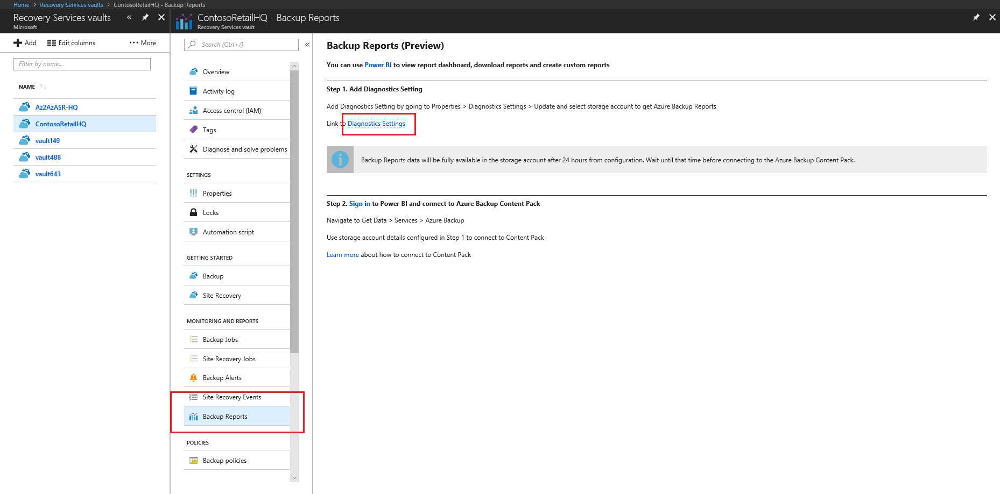
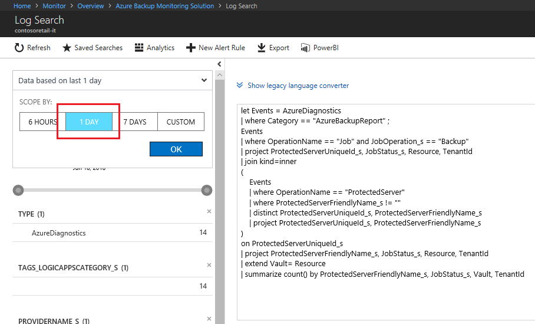
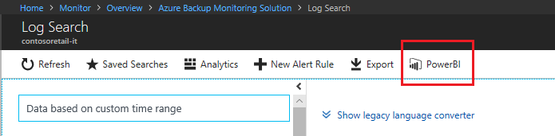
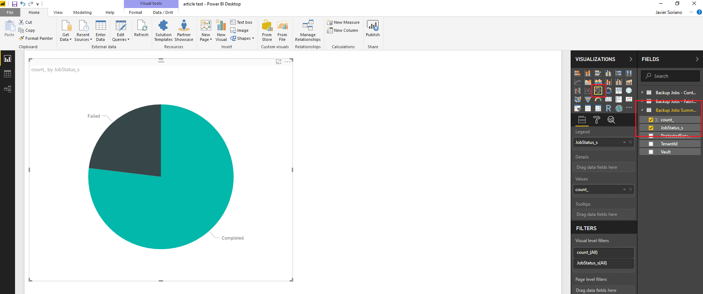

# Create a PowerBI dashboard for Service Providers

This tutorial explains how to build a Power BI dashboard that pulls information from several different Log Analytics workspaces belonging to different Azure Active Directory tenants. 

Log Analytics queries can be ran across workspaces under the same tenant (see [here] (https://docs.microsoft.com/en-us/azure/log-analytics/log-analytics-cross-workspace-search)), but this method doesn't work if the workspaces are located in different tenants. To do this, you can aggregate data in these workspaces through PowerBI. This article provides a step-by-step guide on how to build such a dashboard. 

Such a dashboard can provide a global view of all the customers/tenants being managed by a Service Provider, and therefore, simplify operations such as monitoring, backup or alerting.

In this tutorial you will learn:

> [!div class="checklist"]
> * Enable diagnostics for Recovery Services Vault
> * Export your Log Analytics queries to PowerBI
> * Build a PowerBI report that aggregates data from different workspaces/tenants 
> * Customize a tile in a shared dashboard
> * Understand key metrics for a Service Provider

To complete this tutorial you must have two or more Log Analytics workspaces located in two or more Azure AD tenants. These workspaces should have some logging information to build the first report. For this example, we have used Azure Backup diagnostic logs, but other logs can also be used. You also need to have PowerBI Desktop installed.

> [!NOTE]
> Please review this article before you continue reading [Log Analytics features for Service Providers] (https://docs.microsoft.com/en-us/azure/log-analytics/log-analytics-service-providers#managing-multiple-customers-using-log-analytics).
>
>

## Log in to Azure Portal 

Login in to the Azure Portal at https://portal.azure.com.

## Enable diagnostics for Recovery Services Vault

Before starting, make sure that you have some activity in this Recovery Services Vault, for example some Virtual Machines being backed up against this vault.

Start by opeining your Recovery Services Vault:

1. In the Azure portal, click **All services**. In the list of resources, type **Recovery Services Vault**. As you begin typing, the list filters based on your input. Select **Recovery Services Vault**.
2. In the Recovery Services Vault subscriptions page, select the vault that you will work with
3. Select **Backup Reports** as shown in the picture. <br>
4. Click on **Diagnostics Settings** in the right pane. You will see a lits of diagnostics settings already applied to this vault. This list might be empty.
5. Click on **Add diagnostic setting**. <br><br>
6. Enter a **Name** for this setting, select **Send to Log Analytics** checkbox, choose a **Log Analytics** workspace (or create a new one) and check **AzureBackupReport** checkbox. Click **Save**. <br>

After enabling diagnostics for your recovery service vault, logging data will start flowing into your Log Analytics workspace. These logs will be then available to be queried by the Log Analytics engine.

## Export your Log Analytics query to PowerBI

Now that we have some diagnostic data flowing into our Log Analytics workspace, we can perform queries against this data.

Go to your Log Analytics workspace:

1. In the Azure portal, click **All services** and select **Log Analytics**.
2. Select the **Log Search** tile.
3. Enter a query to see the status of Azure backup jobs.

```
let Events = AzureDiagnostics
| where Category == "AzureBackupReport" ;
Events
| where OperationName == "Job" and JobOperation_s == "Backup" 
| project ProtectedServerUniqueId_s, JobStatus_s, Resource, TenantId
| join kind=inner
(
    Events
    | where OperationName == "ProtectedServer"
    | where ProtectedServerFriendlyName_s != ""
    | distinct ProtectedServerUniqueId_s, ProtectedServerFriendlyName_s
    | project ProtectedServerUniqueId_s, ProtectedServerFriendlyName_s
)
on ProtectedServerUniqueId_s
| project ProtectedServerFriendlyName_s, JobStatus_s, Resource, TenantId
| extend Vault= Resource
| summarize count() by ProtectedServerFriendlyName_s, JobStatus_s, Vault, TenantId
```

<br>

In this query, we are just querying one workspace, but as explained in [here](https://docs.microsoft.com/en-us/azure/log-analytics/log-analytics-cross-workspace-search), you can query across several workspaces within the same tenant if needed. The same query, spanning two workspaces would start as follows:

```
let Events = (union workspace("workspace1").AzureDiagnostics, workspace("workspace2").AzureDiagnostics)
...
```

In this example we suee the workspace name to reference a workspace, but you can also specify its qualified name, workspace ID or Azure Resource ID.

4. Change the time scope to just the last day.<br>. Click **RUN** to verify that the query returns the desired data.
5. Now that we have a query with the info that we want, we can export it to PowerBI. To do this just click the **PowerBI** button at the top of the screen.

<br>

6. This will bring a pop-up to open or save a text file with the PowerBI query in it. **Save As** the file to your local drive and give it a name related to the tenant/workspace you're in.

Repeat steps 1 to 5 with another Log Analytics workspace located in a different Azure AD tenant. The query should be the same.

By the end of this section, you should have two PowerBI queries saved to your local drive. Each of these queries get data from a separate workspace in a separate tenant.

## Build a PowerBI report that aggregates data from different workspaces/tenants

You will now import the Log Analytics queries into PowerBI Desktop, shape the data and build a dashboard.

### Import query into PowerBI

1. Open **PowerBI Desktop**.
2. Click on **Get Data** then **Blank Query**.

<br><br>

3. From the top menu, click **Advanced Editor**.
4. Open one of the text files with the exported query from Log Analytics, copy all contents and paste them into the Advanced Editor.
5. Click **Done**. You should see a table with the same results you saw in Log Analytics.
6. Rename the query to reflect its contents and tenant where is coming from.

Repeat steps 1 to 6 with the other Log Analytics query coming from the other tenant.<br>

### Aggregate queries in PowerBI

Now, you need to aggregate the data from both queries to build a consolidated view. For this, we will use some of the combine features in PowerBI.

1. Within PowerBI query editor, click on **Append Queries as New** under Append Queries.<br>

2. In the Append dialog, select the queries to append and click **OK**.<br>

3. Rename the query with a meaningful name. Click **Close & Apply** button in the left-top corner.

### Build PowerBI report

Now that you have a query with the results that you need, you can build your PowerBI report.

1. From the visualizations pane, select the **Donut Chart** icon. This will print a blank donut chart in your report view.
2. From the fields pane, expand your aggregated query name and check **count_** and **JobStatus_s** fields. You will now see the chart with the number of Completed/Failed backup jobs. You can customize colors, column names and other settings in the Visualizations pane.

<br>

3. Click on any blank part of the report and then, from the visualizations pane, select the **Table** icon.
4. From the fields pane, expand your aggregated query name and check **count_**, **JobStatus_s** and **ProtectedServerFriendlyName_s** fields. Customize the view as required.

<br>


